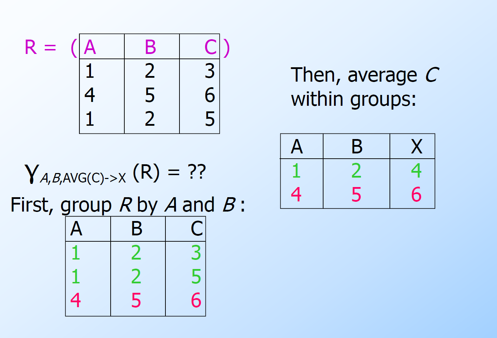

# 第五章：关系代数（Relational Algebra）笔记

## 一、什么是关系代数？

关系代数是一种用于操作关系（表）的数学语言，是数据库查询语言的理论基础。

### 核心概念：
- 操作对象：关系（即表）
- 操作符：选择、投影、连接、集合运算等
- 目标：用这些操作符构建查询表达式，获取我们需要的数据

---

## 二、核心操作符（Core Operators）

| 操作                            | 符号        | 说明                               |
| ------------------------------- | ----------- | ---------------------------------- |
| 并（Union）                     | $\cup$      | 合并两个关系                       |
| 交（Intersection）              | $\cap$      | 取两个关系共有的元组               |
| 差（Difference）                | $-$         | 取第一个中有但第二个中没有的元组   |
| 选择（Selection）               | $\sigma_{C}$    | 筛选满足条件的行                   |
| 投影（Projection）              | $\pi$       | 选出指定列，并去重                 |
| 广义投影（Extended Projection） | $\pi$       | 可以进行计算、重命名               |
| 笛卡尔积（Product）             | $\times$    | 将两个表的所有行组合起来           |
| Theta 连接（Theta Join）        | $\bowtie_C$ | 基于条件$C$的连接（如$A = B$）     |
| 自然连接（Natural Join）        | $\bowtie$   | 自动按同名属性等值连接，去掉重复列 |
| 重命名（Renaming）              | $\rho$      | 给关系或属性起新名字               |
| 去重（Duplicate Elimination）   | $\delta$    | 去重，将重复元组合并为一条         |
| 排序（Sorting）                | $\tau$       | 按指定属性排序                     |
| 分组（Grouping）               | $\gamma_{L}$     | 按指定属性分组                     |
---

## 三、详细讲解每个操作符

### 1. 选择（$\sigma_{C}$）

从一个关系中选出满足条件$C$的元组（行）

#### 示例：

$$JoeMenu := \sigma_{bar="Joe's"}(Sells)$$

表示从 `Sells` 表中选出 `bar = "Joe's"` 的所有记录。

---

### 2. 投影（$\pi$）

从一个关系中选出某些列（属性），并去除重复元组

#### 示例：

$$Prices := \pi_{beer, price}(Sells)$$

从 `Sells` 表中选出 `beer` 和 `price` 列，并去重。

---

### 3. 广义投影（Extended Projection）

在投影时可以添加新的列，比如通过计算生成新列，也可以对已有列重命名

#### 示例：

设关系$R(A, B)$为：

$$
\begin{bmatrix}
1 & 2 \\
3 & 4
\end{bmatrix}
$$

广义投影：

$$\pi_{A+B \rightarrow C, A, A}(R)$$

结果为：

$$
\begin{bmatrix}
C & A_1 & A_2 \\
3 & 1   & 1   \\
7 & 3   & 3
\end{bmatrix}
$$

---

### 4. 笛卡尔积（$\times$）

将两个关系的所有元组进行配对，形成一个新的关系

#### 示例：

$$R3 := R1 \times R2$$

注意：如果两个表有相同属性名，需要加前缀区分，如 `R1.A`, `R2.A`

---

### 5. Theta 连接（$\bowtie_C$）

先做笛卡尔积，再根据某个条件筛选出符合条件的元组

#### 示例：

$$BarInfo := Sells \bowtie_{Sells.bar=Bars.name} Bars$$

相当于先做乘积，再选 `bar` 相同的记录。

---

### 6. 自然连接（$\bowtie$）

自动按照相同名称的属性进行等值连接，并自动去掉重复列

#### 示例：

$$BarInfo := Sells \bowtie Bars$$

系统会自动按 `bar` 字段连接，并只保留一份 `bar` 列。

---

### 7. 重命名（$\rho$）

给关系或属性起新名字，常用于避免列名冲突

#### 示例：

$$\rho_R(bar, addr)(Bars)$$

将 `Bars(name, addr)` 重命名为 `R(bar, addr)`

### 8. 去重（$\delta$）

去重，将重复元组合并为一条


### 9. 排序（$\tau_{L}$）

按指定属性排序
$L$ 是排序的属性列表，默认升序



---

## 四、构建复杂表达式的方法

### 1. 使用赋值语句

$$
R4 := R1 \times R2 \\
R3 := \sigma_C(R4)
$$

### 2. 嵌套表达式

$$
R3 := \sigma_C(R1 \times R2)
$$

### 3. 表达式树（Expression Tree）

图形化表示查询流程，根节点是最终结果，子节点是输入和操作。

#### 示例：

```
       ∪
      / \
 πname   πbar
    |       |
 σaddr=“Maple St.”   σprice<3 AND beer=“Bud”
    |                   |
  Bars               Sells
```

---

## 五、结果模式（Schema of Results）

| 操作       | 结果模式                     |
| ---------- | ---------------------------- |
| 并、交、差 | 同两个操作数的模式           |
| 选择       | 与原表结构相同               |
| 投影       | 指定列组成的结构             |
| 笛卡尔积   | 所有属性合并，若重名则加前缀 |
| Theta 连接 | 同笛卡尔积                   |
| 自然连接   | 合并两个表的属性，去掉重复列 |
| 重命名     | 按照重命名规则来定义         |

---

## 六、多包代数（Bag Algebra）

SQL 实际上是一种基于“包”（bag 或 multiset）的语言，即允许重复元组存在。

### 包 vs 集合

| 操作             | 包的行为                               | 集合的行为                         |
| ---------------- | -------------------------------------- | ---------------------------------- |
| 选择（$\sigma$） | 对每一行单独处理，不影响重复性         | 同左                               |
| 投影（$\pi$）    | 不去重                                 | 去重                               |
| 并（$\cup$）     | 求和（如$\{1\} \cup \{1\} = \{1,1\}$） | 合并（$\{1\} \cup \{1\} = \{1\}$） |
| 交（$\cap$）     | 取最小出现次数                         | 同集合                             |
| 差（$-$）        | 出现次数相减（不能为负）               | 同集合                             |

---

## 七、关系代数定律（Algebra Laws）

一些在集合代数中成立的定律在包代数中不一定成立：

| 定律                              | 是否适用于包？           |
| --------------------------------- | ------------------------ |
| 并交换律（$R \cup S = S \cup R$） | ✅ 成立                   |
| 并幂等律（$R \cup R = R$）        | ❌ 不成立（包中变成两倍） |
| 连接结合律                        | ✅ 成立                   |
| 分配律                            | ❌ 不一定成立             |

---

## 八、总结表格

| 操作符      | 中文名     | 功能                             |
| ----------- | ---------- | -------------------------------- |
| $\sigma$    | 选择       | 选出满足条件的行                 |
| $\pi$       | 投影       | 选出某些列                       |
| $\times$    | 笛卡尔积   | 两表所有行组合                   |
| $\bowtie_C$ | Theta 连接 | 按条件连接                       |
| $\bowtie$   | 自然连接   | 按同名属性等值连接               |
| $\rho$      | 重命名     | 更改关系或属性名                 |
| $\cup$      | 并         | 合并两个关系                     |
| $\cap$      | 交         | 取两个关系共有的元组             |
| $-$         | 差         | 取第一个中有但第二个中没有的元组 |

---

## 九、典型应用示例

### 示例 1：查找住在 Maple St 的酒吧名字

$$\pi_{name}(\sigma_{addr="Maple St."}(Bars))$$

### 示例 2：查找卖 Bud 啤酒价格低于$3 的酒吧

$$\pi_{bar}(\sigma_{beer="Bud" \land price < 3}(Sells))$$

### 示例 3：查找既在 Maple St 上又卖 Bud 的酒吧（并集）

$$\pi_{name}(\sigma_{addr="Maple St."}(Bars)) \cup \pi_{bar}(\sigma_{beer="Bud" \land price < 3}(Sells))$$

---

如果你需要我帮你整理成 PDF、Word 文档，或者想看图解、练习题，都可以告诉我 😊
