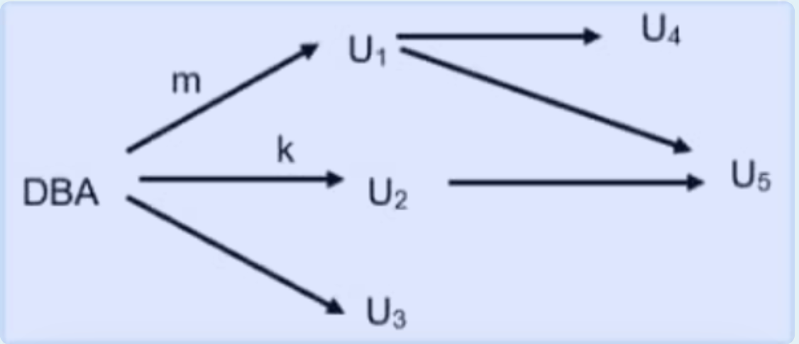

# 2022年网传往年题

## 选择题
### 试题1

Which is a weak entity type implies?  
- a. Reltionship with total participation constrain  
- b. Strong relationship type  
- c. Relationship with partial participation constraint  
- d. Weak relationship type  

:::details 中文翻译和解析
**中文题目：**
弱实体类型意味着什么？
- a. 具有全参与约束的关系
- b. 强关系类型
- c. 具有部分参与约束的关系
- d. 弱关系类型

**答案**：a

**解析**：弱实体类型是指没有足够的属性来形成主键的实体类型，它必须依赖于另一个强实体类型，并且与强实体类型之间存在具有全参与约束的关系。所以选项a正确。
:::


### 试题2
Which of the following is true about views being up to date?  
- a. Views are never up to date, there is always a lag time  
- b. Views can be automatically made up to date periodically by the system.  
- c. Views are always up to date  
- d. Views are up to date only after the synchronization operation by the user  

:::details 中文翻译和解析
**中文题目：**
关于视图是否最新，以下哪项是正确的？
- a. 视图永远不会是最新的，总会有延迟
- b. 系统可以定期自动使视图保持最新
- c. 视图总是最新的
- d. 只有在用户执行同步操作后，视图才是最新的

**答案**：c

**解析**：
- a. Views are never up to date, there is always a lag time - 错误。对于普通视图（Regular View）来说，它们只是对基础表的查询结果的虚拟表示，每次查询视图时都会动态执行底层查询，因此它是基于当前数据的，没有"lag time"。
- b. Views can be automatically made up to date periodically by the system - 不准确。普通视图不是定期自动更新的，而是在每次使用时重新执行查询。如果你说的是物化视图（Materialized View），这个说法才成立，因为物化视图会存储实际数据，并可以设置为定时刷新。但题目中没有提到"materialized"。
- c. Views are always up to date - ✅ 正确。这是针对普通视图（Regular View）来说的。视图本质上是一个保存的 SQL 查询，它并不存储数据。当你查询视图时，它直接从底层表获取最新的数据，所以视图总是反映的是基础表的最新状态。
- d. Views are up to date only after the synchronization operation by the user - 错误。这更像是描述某些缓存机制或物化视图的行为，而不是普通视图。
:::


### 试题3
Which is the function of ROLLBACK In a transaction?  
- a. Roll only the inserts and deletes of an aborted transaction into the database.  
- b. Discard all the updates (including insert, deletes, modifications) of a transaction from the database  
- c. Roll the updates (including inserts, deletes, modifications) of an aborted transaction into the database  
- d. Discard only the inserts and updates of a transaction from the database  

:::details 中文翻译和解析
**中文题目：**
事务中ROLLBACK的功能是什么？
- a. 仅将中止事务的插入和删除操作回滚到数据库中
- b. 从数据库中丢弃事务的所有更新（包括插入、删除、修改）
- c. 将中止事务的更新（包括插入、删除、修改）回滚到数据库中
- d. 仅从数据库中丢弃事务的插入和更新操作

**答案**：b

**解析**：
在数据库中，`ROLLBACK` 是事务处理中的一个命令，用于撤销当前事务中所有尚未提交（COMMIT）的更改，并将数据库恢复到该事务开始之前的状态。
- a. "Roll into" 表示写入数据库，这和 `ROLLBACK` 的作用相反，而且它只提到了 insert 和 delete，忽略了 update。
- b. ✅ 正确。`ROLLBACK` 就是用来丢弃一个事务中所有的变更：插入（INSERT）、删除（DELETE）、修改（UPDATE）。
- c. "roll into" 是写入数据库，这是 `COMMIT` 做的事，不是 `ROLLBACK`。
- d. 这个说法不完整，漏掉了删除（DELETE）操作。
:::


### 试题4
Consider a table with atomic attributes A, B, and C and the following functional dependencies.  
$$ A \to B, B \to C $$  
If the primary key of this table is attribute A, which is highest normal forms this relation satisfies?  
- a. 2NF  
- b. 1NF  
- c. BCNF  
- d. 3NF  

:::details 中文翻译和解析
**中文题目：**
考虑一个具有原子属性A、B和C的表，以及以下函数依赖：
$$ A \to B, B \to C $$
如果该表的主键是属性A，那么该关系满足的最高范式是什么？
- a. 2NF
- b. 1NF
- c. BCNF
- d. 3NF

**答案**：d

**解析**：
- 1NF：属性具有原子性，该表满足。
- 2NF：消除非主属性对主键的部分函数依赖，这里非主属性B、C对主键A都是完全函数依赖，满足。
- 3NF：消除非主属性对主键的传递函数依赖，虽然有$A \to B, B \to C$，但C对A的传递依赖是允许的，满足。
- BCNF：每一个非平凡的函数依赖的左边必须包含主键，这里$B \to C$不满足，不满足BCNF。所以最高满足3NF，选d。
:::


### 试题5
If $X \to Y$, which of the following would make $Y$ fully dependent on $X$, then  
- a. $X$ consists of multiple attributes  
- b. $X$ is a single attribute  
- c. $Y$ consists of multiple attributes  
- d. $Y$ is a single attribute

:::details 中文翻译和解析
**中文题目：**
如果$X \to Y$，以下哪项会使$Y$完全依赖于$X$？
- a. $X$由多个属性组成
- b. $X$是单个属性
- c. $Y$由多个属性组成
- d. $Y$是单个属性

**答案**：b

**解析**：当$X$是单个属性时，$Y$完全依赖于$X$。如果$X$由多个属性组成，可能存在部分依赖。所以选b。
:::  


### 试题6
Which of the following is true about primary keys and foreign keys holding NULL value?  
- a. A primary key cannot hold a NULL value and a foreign key cannot hold a NULL value  
- b. A primary key can hold a NULL value and a foreign key can hold a NULL value  
- c. A primary key cannot hold a NULL value and a foreign key can hold a NULL value  
- d. A primary key can hold a NULL value and a foreign key cannot hold a NULL value  

:::details 中文翻译和解析
**中文题目：**
关于主键和外键是否可以为NULL值，以下哪项是正确的？
- a. 主键不能为NULL值，外键也不能为NULL值
- b. 主键可以为NULL值，外键也可以为NULL值
- c. 主键不能为NULL值，外键可以为NULL值
- d. 主键可以为NULL值，外键不能为NULL值

**答案**：c

**解析**：主键的作用是唯一标识表中的记录，不能为NULL值；外键是用于建立表与表之间的关联，允许为NULL值，表示该记录可能没有关联的记录。所以选c。
:::


### 试题7
An insertion operation will  if the insertion violates the uniqueness property of a key.  
- a. crash the system  
- b. fail  
- c. succeed with warning  
- d. succeed without warning  

:::details 中文翻译和解析
**中文题目：**
如果插入操作违反了键的唯一性属性，会发生什么？
- a. 系统崩溃
- b. 插入失败
- c. 插入成功但有警告
- d. 插入成功且无警告

**答案**：b

**解析**：如果插入操作违反了键的唯一性属性，插入操作会失败，数据库会阻止该插入以保证数据的完整性。所以选b。
:::


### 试题8
An exclusive lock on a data item represents permission to perform which of the operations, read and write, on the data item?  
- a. Write only  
- b. Both read and write  
- c. Read only  
- d. Neither read nor writ  

:::details 中文翻译和解析
**中文题目：**
对数据项的排他锁表示允许对该数据项执行哪些操作（读和写）？
- a. 仅写
- b. 读写都可以
- c. 仅读
- d. 读写都不可以

**答案**：b

**解析**：排他锁（X锁）表示对数据项具有独占的访问权限，允许进行读写操作，其他事务不能再对该数据项加任何锁。所以选b。
:::


### 试题9
In a two-phase locking protocol, what happens during the shrinking phase?  
- a. The transaction can acquire locks, but cannot release its locks  
- b. The transaction can acquire locks, and can release its locks.  
- c. The transaction cannot acquire locks, but can release its locks  
- d. The transaction can acquire locks, and can release its locks as long as the number of released locks is greater than the number of acquired locks.  

:::details 中文翻译和解析
**中文题目：**
在两阶段锁协议中，收缩阶段会发生什么？
- a. 事务可以获取锁，但不能释放其锁
- b. 事务可以获取锁，也可以释放其锁
- c. 事务不能获取锁，但可以释放其锁
- d. 事务可以获取锁，并且只要释放的锁数量大于获取的锁数量，就可以释放其锁

**答案**：c

**解析**：在两阶段锁协议中，收缩阶段事务不能再获取锁，但可以释放已经持有的锁。所以选c。
:::


### 试题10
Given the following table definition:  
```sql
CREATE TABLE class_list (
    studentId INTEGER, 
    grade INTEGER,
    CONSTRAINT chk CHECK (grade <=100)
)
```  
and the statement  
```sql
INSERT INTO class_list VALUES (98,100)
INSERT INTO class_list VALUES (123,123)
INSERT INTO class_list VALUES (101,98)
```  
How many records will be retrieved by the following statement?  
```sql
SELECT * FROM Class_list
```  
- a. 0  
- b. 2  
- c. 3  
- d. 1

:::details 中文翻译和解析
**中文题目：**
给定以下表定义：
```sql
CREATE TABLE class_list (
    studentId INTEGER, 
    grade INTEGER,
    CONSTRAINT chk CHECK (grade <=100)
)
```
以及以下语句：
```sql
INSERT INTO class_list VALUES (98,100)
INSERT INTO class_list VALUES (123,123)
INSERT INTO class_list VALUES (101,98)
```
以下语句将检索到多少条记录？
```sql
SELECT * FROM Class_list
```
- a. 0
- b. 2
- c. 3
- d. 1

**答案**：b

**解析**：表`class_list`有一个CHECK约束`grade <=100`，`INSERT INTO class_list VALUES (123,123)`违反了该约束，插入失败，而`INSERT INTO class_list VALUES (98,100)`和`INSERT INTO class_list VALUES (101,98)`插入成功，所以查询`SELECT * FROM Class_list`将检索到2条记录。选b。
:::  


### 试题11
When defining a referential constraint between the parent table T2 and the dependent table T1, which of the following is true?  
- a. The list of column names in the FOREIGN KEY clause can be a subset of the list of column names in the primary key of T1 or a UNIQUE constraint that exists on T1.  
- b. The list of column names in the FOREIGN KEY clause must be identical to the list of column names in the primary key of T2 or a UNIQUE constraint that exists on T2  
- c. The list of column names in the FOREIGN KEY clause must be identical to the list of column names in the primary key of T1 or a UNIQUE constraint that exists on T1.  
- d. The list of column names in the FOREIGN KEY clause can be a subset of the list of column names in the primary key of T2 or a UNIQUE constraint that exists on T2.  

:::details 中文翻译和解析
**中文题目：**
在定义父表T2和依赖表T1之间的引用约束时，以下哪项是正确的？
- a. FOREIGN KEY子句中的列名列表可以是T1主键或T1上存在的唯一约束中列名列表的子集
- b. FOREIGN KEY子句中的列名列表必须与T2主键或T2上存在的唯一约束中的列名列表相同
- c. FOREIGN KEY子句中的列名列表必须与T1主键或T1上存在的唯一约束中的列名列表相同
- d. FOREIGN KEY子句中的列名列表可以是T2主键或T2上存在的唯一约束中列名列表的子集

**答案**：b

**解析**：在定义父表T2和依赖表T1之间的引用约束时，FOREIGN KEY子句中的列名列表必须与T2主键或T2上存在的唯一约束中的列名列表相同，以确保引用的完整性。所以选b。
:::


### 试题12
You are a database developer for a toy manufacturer. Each employee of the company is assigned to either an executive, administrative, or labor position. The home page of the company intranet displays company news that is customized for each position type. When an employee logs on to the company intranet, the home page identifies the employee's position type and displays the appropriate company news.  
Company news is stored in a table named News, which is located in the corporate database. The script that was used to create the News table is shown below:  
```sql
CREATE TABLE News (
    NewsID int NOT NULL,
    NewsText varchar(8008) NOT NULL,
    EmployeePositionType char(15) NOT NULL,
    DisplayUntil datetime NOT NULL,
    DateAdded datetime NOT NULL DEFAULT (getdate()),
    CONSTRAINT PK_News PRIMARY KEY (NewsID)
)
```  
Users of the intranet need to view data in the news table, but do not need to insert, update, or delete data in the table. You need to deliver only the appropriate data to the intranet, based on the employee's position type.  
What should you do?  
- a. Grant permission on the News table for each position type.  
- b. Grant SELECT permissions on the EmployeePositionType column for each position type  
- c. Create a stored procedure that returns the rows that apply to a specified position type  

:::details 中文翻译和解析
**中文题目：**
你是一家玩具制造商的数据库开发人员。公司的每个员工都被分配到高管、行政或劳动岗位。公司内部网的主页会显示针对每个岗位类型定制的公司新闻。当员工登录公司内部网时，主页会识别员工的岗位类型并显示相应的公司新闻。

公司新闻存储在名为News的表中，该表位于公司数据库中。用于创建News表的脚本如下：
```sql
CREATE TABLE News (
    NewsID int NOT NULL,
    NewsText varchar(8008) NOT NULL,
    EmployeePositionType char(15) NOT NULL,
    DisplayUntil datetime NOT NULL,
    DateAdded datetime NOT NULL DEFAULT (getdate()),
    CONSTRAINT PK_News PRIMARY KEY (NewsID)
)
```

内部网的用户需要查看新闻表中的数据，但不需要插入、更新或删除表中的数据。你需要根据员工的岗位类型仅向内部网提供相应的数据。

你应该怎么做？
- a. 为每个岗位类型授予对News表的权限
- b. 为每个岗位类型授予对EmployeePositionType列的SELECT权限
- c. 创建一个存储过程，该过程返回适用于指定岗位类型的行

**答案**：c

**解析**：用户只需要查看数据，不需要插入、更新或删除。创建一个存储过程，根据员工的岗位类型返回相应的新闻记录，可以满足需求，并且可以更好地控制数据的访问。授予表权限或列权限不够灵活，不能根据岗位类型动态筛选数据。所以选c。
:::


### 试题13
You have a Gauss database that contains tables named Customers and Orders. The tables are related by a column named CustomerID. You need to create a query that meets the following requirements:  
- Returns the CustomerName for all customers and the OrderDate for any orders that they have placed.  
- Results must include customers who have not placed any orders.  
Which Transact-SQL query should you use?  
- a. `SELECT CustomerName, orderDate FROM Customers RIGHT OUTER JOIN Orders ON Customers.customerID = Orders.customerID`  
- b. `SELECT CustomerName, orderDate FROM Customers LEFT OUTER JOIN Orders ON Customers.CustomerID = Orders.CustomerID`  
- c. `SELECT CustomerName, orderDate FROM Customers JOIN Orders ON Customers.CustomerID = Orders.CustomerID`  
- d. `SELECT CustomerName, orderDate FROM Customers CROSS JOIN Orders ON customers.customerID = orders.customerID`  

:::details 中文翻译和解析
**中文题目：**
你有一个Gauss数据库，其中包含名为Customers和Orders的表。这两个表通过名为CustomerID的列相关联。你需要创建一个查询，该查询需要满足以下要求：
- 返回所有客户的CustomerName以及他们所下的任何订单的OrderDate。
- 结果必须包括没有下过任何订单的客户。

你应该使用哪个Transact-SQL查询？
- a. `SELECT CustomerName, orderDate FROM Customers RIGHT OUTER JOIN Orders ON Customers.customerID = Orders.customerID`
- b. `SELECT CustomerName, orderDate FROM Customers LEFT OUTER JOIN Orders ON Customers.CustomerID = Orders.CustomerID`
- c. `SELECT CustomerName, orderDate FROM Customers JOIN Orders ON Customers.CustomerID = Orders.CustomerID`
- d. `SELECT CustomerName, orderDate FROM Customers CROSS JOIN Orders ON customers.customerID = orders.customerID`

**答案**：b

**解析**：需要返回所有客户的信息，包括没有下过订单的客户，使用左外连接（LEFT OUTER JOIN）可以实现。左外连接会返回左表（Customers）中的所有记录，以及右表（Orders）中匹配的记录。所以选b。
:::


### 试题14
You are a Gauss database developer for a company that compiles statistics for baseball teams. These statistics are stored in a database named Statistics. The Players of each team are entered in a table name Rosters table in the Statistics database. The script that was used to create the Rosters table is shown below:  
```sql
CREATE TABLE Rosters (
    RosterID int NOT NULL,
    TeamID int NOT NULL,
    FirstName char(20) NOT NULL,
    -- 此处可能缺失部分字段，原文未完整显示
)
```  
The number of players on the team never exceeds the maximum. What should you do?  
- a. Create a rule that validates the data  
- b. Create an update view that includes the WITH CHECK OPTION Clause in its definition  
- c. Add a CHECK constraint on the Rosters table to validate the data  
- d. Create a trigger on the Rosters table that validates the data  

:::details 中文翻译和解析
**中文题目：**
你是一家为棒球队编译统计数据的公司的Gauss数据库开发人员。这些统计数据存储在名为Statistics的数据库中。每个球队的球员信息记录在Statistics数据库中的Rosters表中。用于创建Rosters表的脚本如下：
```sql
CREATE TABLE Rosters (
    RosterID int NOT NULL,
    TeamID int NOT NULL,
    FirstName char(20) NOT NULL,
    -- 此处可能缺失部分字段，原文未完整显示
)
```

球队的球员数量从未超过最大值。你应该怎么做？
- a. 创建一个验证数据的规则
- b. 创建一个更新视图，该视图在其定义中包含WITH CHECK OPTION子句
- c. 在Rosters表上添加一个CHECK约束来验证数据
- d. 在Rosters表上创建一个触发器来验证数据

**答案**：c

**解析**：球队球员数量从未超过最大值，在Rosters表上添加一个CHECK约束来验证数据，可以简单有效地保证数据的合法性。创建规则、视图或触发器相对复杂，不是最优选择。所以选c。
:::


### 试题15
You have two table Employee, Salary in the database. You discover the following facts:  
I. Employee table will often joined with salary table on EmployeeID.  
II. Individual records in Employee table will be selected on the basis of SCN number.  
III. List of employees will be created in alphabetical list order by Last_name, First name.  
Choose proper indexing strategy of the following:  
1) Create composite clustered index on Employee table last_name, First name  
2) Create index on Employee table First name, Create index on Employee table Last name  
3) Create unique index on Employee table Employeeid.  
4) Create unique index on Employee table SCN.  
5) Create clustered index on Employee table Employeeid  
6) Create clustered index on Employee table SCN.  

- a. 1,3,6  
- b. 2,4,5  
- c. 1,3,4  
- d. 2,3,4

:::details 中文翻译和解析
**中文题目：**
数据库中有两个表Employee和Salary。你发现以下事实：
I. Employee表经常与Salary表通过EmployeeID进行连接。
II. Employee表中的单个记录将根据SCN编号进行选择。
III. 员工列表将按LastName和FirstName的字母顺序创建。

选择合适的索引策略：
1) 在Employee表的LastName和FirstName上创建复合聚集索引
2) 在Employee表的FirstName上创建索引，在Employee表的LastName上创建索引
3) 在Employee表的EmployeeID上创建唯一索引
4) 在Employee表的SCN上创建唯一索引
5) 在Employee表的EmployeeID上创建聚集索引
6) 在Employee表的SCN上创建聚集索引

- a. 1,3,6
- b. 2,4,5
- c. 1,3,4
- d. 2,3,4

**答案**：c

**解析**：
- 1) 在Employee表的LastName和FirstName上创建复合聚集索引，可满足按LastName和FirstName字母顺序创建员工列表的需求。
- 3) 在Employee表的EmployeeID上创建唯一索引，可提高Employee表与Salary表通过EmployeeID连接的效率。
- 4) 在Employee表的SCN上创建唯一索引，可提高根据SCN编号选择单个记录的效率。

所以选c。
:::  

## 计算题

### 试题16
Proofs(Use FD definition): If $X \to Y$, $WY \to Z$, then $XW \to Z$.  

:::details 中文翻译和解析
**中文题目：**
证明（使用函数依赖定义）：如果$X \to Y$，$WY \to Z$，那么$XW \to Z$。

**证明**：
已知$X \to Y$，根据函数依赖的增广律，在两边同时加上$W$，可得$XW \to WY$。
又已知$WY \to Z$，根据函数依赖的传递律，由$XW \to WY$和$WY \to Z$，可以推出$XW \to Z$。
:::


### 试题17
Suppose we have relation $R(A,B,C,D,E)$, the FDs is  
$F = \{AB \to C, B \to D, C \to E, EC \to B, AC \to B\}$  
Computing: $(AC)+$, Candidate Key of $R$  

:::details 中文翻译和解析
**中文题目：**
假设我们有关系$R(A,B,C,D,E)$，函数依赖集为：
$F = \{AB \to C, B \to D, C \to E, EC \to B, AC \to B\}$
计算：$(AC)+$，$R$的候选键。

**计算$(AC)+$**：
1. 初始：$(AC)^+ = \{A, C\}$。
2. 因为$AC \to B$，所以$(AC)^+ = \{A, B, C\}$。
3. 因为$AB \to C$（已有$A, B$），不增加新属性。
4. 因为$B \to D$，所以$(AC)^+ = \{A, B, C, D\}$。
5. 因为$C \to E$，所以$(AC)^+ = \{A, B, C, D, E\}$。

**计算候选键**：
从函数依赖集可以看出，$AB$能决定所有属性，$AC$能决定所有属性。
由于没有更小的属性集能决定所有属性，所以候选键为$AB$和$AC$。
:::


### 试题18
Suppose we have relational schema $R(A,B,C,D,E,G)$, the FDs is  
$F = \{A \to BC, D \to EG, A \to B, E \to C, BC \to D, CG \to BD, ACD \to B, CE \to AG\}$  
Computing: $F_{m}$

:::details 中文翻译和解析
**中文题目：**
假设我们有关系模式$R(A,B,C,D,E,G)$，函数依赖集为：
$F = \{A \to BC, D \to EG, A \to B, E \to C, BC \to D, CG \to BD, ACD \to B, CE \to AG\}$
计算：$F_{m}$（最小函数依赖集）。

**计算$F_{m}$（最小函数依赖集）**：
1. **右部单一化**：
   - $F = \{A \to B, A \to C, D \to E, D \to G, A \to B, E \to C, BC \to D, CG \to B, CG \to D, ACD \to B, CE \to A, CE \to G\}$，去除重复的$A \to B$，得到$F = \{A \to B, A \to C, D \to E, D \to G, E \to C, BC \to D, CG \to B, CG \to D, ACD \to B, CE \to A, CE \to G\}$。
2. **去除冗余的函数依赖**：
   - 逐一检查每个函数依赖，通过计算闭包判断是否冗余。
   - 经过检查，没有冗余的函数依赖。
3. **去除左边冗余的属性**：
   - 对于$ACD \to B$，计算$(AC)^+$，发现不能推出$B$，计算$(AD)^+$，发现不能推出$B$，计算$(CD)^+$，发现不能推出$B$，所以$ACD \to B$左边没有冗余属性。

所以$F_{m} = \{A \to B, A \to C, D \to E, D \to G, E \to C, BC \to D, CG \to B, CG \to D, ACD \to B, CE \to A, CE \to G\}$。
:::  


## 简答题
### 试题19
Here is an authorization graph.  



I. List the users who still have authorization after only edge m is moved  
II. List the users who still have authorization after only edge k is moved.  

:::details 中文翻译和解析
**中文题目：**
这里有一个授权图。


I. 仅移除边m后，仍具有授权的用户有哪些？
II. 仅移除边k后，仍具有授权的用户有哪些？

**解析**：
**I. 仅移除边m后**：
需要根据具体的授权图来确定，从图中找到那些不依赖边m获得授权的用户。假设授权图中用户通过边的传递获得授权，移除边m后，不经过边m就能获得授权的用户仍然具有授权。

**II. 仅移除边k后**：
同理，从图中找到不依赖边k获得授权的用户，这些用户仍然具有授权。
:::


### 试题20
Is this schedule a serial schedule?  
$S=lx_1(A)r_1(A)w_1(A)u_1(A)lx_2(A)r_2(A)w_2(A)u_2(A)lu_2(B)r_2(B)w_2(B)u_2(B)ls_1(B)r_1(B)w_1(B)u_1(B)$
Give the rules to judge a conflict serializable schedule.  

:::details 中文翻译和解析
**中文题目：**
这个调度是串行调度吗？
$S=lx_1(A)r_1(A)w_1(A)u_1(A)lx_2(A)r_2(A)w_2(A)u_2(A)lu_2(B)r_2(B)w_2(B)u_2(B)ls_1(B)r_1(B)w_1(B)u_1(B)$
给出判断冲突可串行化调度的规则。

**解析**：
**判断是否为串行调度**：
该调度不是串行调度，串行调度是指事务一个接一个地依次执行，而此调度中事务的操作有交叉。

**判断冲突可串行化调度的规则**：
1. 交换不冲突的操作：如果两个操作是对不同数据项的操作，或者一个是读操作一个是写操作且不涉及同一数据项，则它们不冲突，可以交换顺序。
2. 若通过交换不冲突的操作能将一个调度转换为一个串行调度，则该调度是冲突可串行化调度。
:::


### 试题21
What are isolation levels of transaction in SQL?  

:::details 中文翻译和解析
**中文题目：**
SQL中事务的隔离级别有哪些？

**解析**：
SQL中事务的隔离级别有：
1. **READ UNCOMMITTED（读未提交）**：允许一个事务读取另一个事务未提交的数据，可能会出现脏读、不可重复读和幻读问题。
2. **READ COMMITTED（读已提交）**：一个事务只能读取另一个事务已经提交的数据，避免了脏读，但可能会出现不可重复读和幻读问题。
3. **REPEATABLE READ（可重复读）**：在一个事务中多次读取同一数据时，保证读取到的数据是一致的，避免了脏读和不可重复读，但可能会出现幻读问题。
4. **SERIALIZABLE（串行化）**：最高的隔离级别，事务串行执行，避免了脏读、不可重复读和幻读问题，但并发性能最差。
:::

### 试题22
What are the properties of transaction?

:::details 中文翻译和解析
**中文题目：**
事务的特性有哪些？

**解析**：
事务的特性（ACID）有：
1. **原子性（Atomicity）**：事务是一个不可分割的操作单元，要么全部执行，要么全部不执行。
2. **一致性（Consistency）**：事务执行前后，数据库的状态必须保持一致，即满足所有的完整性约束。
3. **隔离性（Isolation）**：多个事务并发执行时，一个事务的执行不应该影响其他事务的执行，每个事务都感觉不到其他事务的存在。
4. **持久性（Durability）**：事务一旦提交，其对数据库的更改就是永久性的，即使系统出现故障也不会丢失。
:::  


## 翻译题
### 试题23
The redundancy that comes from MVD's is not removable by putting the database schema in BCNF. There is a stronger normal form, called 4NF, that (intuitively) treats MVD's as FD's when it comes to decomposition, but not when determining keys of the relation. 4NF need to infer MVD's from given FD's and MVD's that may not be violations themselves.  

:::details 中文翻译和解析
**中文翻译：**
由多值依赖（MVD）带来的冗余无法通过将数据库模式转换为BCNF来消除。有一种更强的范式，称为4NF，直观地说，在进行分解时，它将多值依赖视为函数依赖，但在确定关系的键时则不然。4NF需要从给定的函数依赖和多值依赖中推断出可能本身并不构成违规的多值依赖。
:::

## 问答题
### 试题24
Explain lock: S, X, U, IS, IX, SIX and give the symmetric table.  

:::details 中文翻译和解析
**中文题目：**
解释锁：S（共享锁）、X（排他锁）、U（更新锁）、IS（意向共享锁）、IX（意向排他锁）、SIX（共享意向排他锁），并给出对称表。

**解析**：
**锁的解释**：
- **S（共享锁）**：用于读操作，多个事务可以同时对同一数据项加共享锁，允许并发读取数据，但不允许其他事务加排他锁修改数据。
- **X（排他锁）**：用于写操作，一个事务对数据项加排他锁后，其他事务不能再对该数据项加任何锁，保证数据的独占访问。
- **U（更新锁）**：用于更新操作的中间阶段，防止多个事务同时对同一数据项进行更新操作，避免死锁。在更新操作开始时加更新锁，在真正进行写操作时将更新锁升级为排他锁。
- **IS（意向共享锁）**：表示事务打算对某个数据项的某个下级节点加共享锁，用于表明事务的意向，提高并发性能。
- **IX（意向排他锁）**：表示事务打算对某个数据项的某个下级节点加排他锁。
- **SIX（共享意向排他锁）**：表示事务对数据项加共享锁，同时打算对该数据项的某个下级节点加排他锁。

**对称表（锁的兼容性矩阵）**：
|  | S | X | U | IS | IX | SIX |
| --- | --- | --- | --- | --- | --- | --- |
| S | 兼容 | 不兼容 | 不兼容 | 兼容 | 不兼容 | 不兼容 |
| X | 不兼容 | 不兼容 | 不兼容 | 不兼容 | 不兼容 | 不兼容 |
| U | 不兼容 | 不兼容 | 不兼容 | 兼容 | 不兼容 | 不兼容 |
| IS | 兼容 | 不兼容 | 兼容 | 兼容 | 兼容 | 兼容 |
| IX | 不兼容 | 不兼容 | 不兼容 | 兼容 | 兼容 | 不兼容 |
| SIX | 不兼容 | 不兼容 | 不兼容 | 兼容 | 不兼容 | 不兼容 |
:::


### 试题25
Give some examples to show and explain the different rules between a sets and bags  

:::details 中文翻译和解析
**中文题目：**
给出一些示例来展示并解释集合（sets）和包（bags）之间的不同规则。

**解析**：
**集合（sets）和包（bags）的区别示例**：
- **集合（sets）**：集合中的元素是唯一的，不允许重复。例如，集合$\{1, 2, 2, 3\}$实际上等同于$\{1, 2, 3\}$。在集合的并集操作中，重复的元素只出现一次。如$A = \{1, 2\}$，$B = \{2, 3\}$，$A \cup B = \{1, 2, 3\}$。
- **包（bags）**：包允许元素重复。例如，包$[1, 2, 2, 3]$中元素2出现了两次。在包的并集操作中，重复的元素会保留其重复次数。如$A = [1, 2]$，$B = [2, 3]$，$A \cup B = [1, 2, 2, 3]$。
:::


### 试题26
How to decompose a relation into BCNF based on FDs?

:::details 中文翻译和解析
**中文题目：**
如何根据函数依赖将一个关系分解为BCNF？

**解析**：
根据函数依赖将一个关系分解为BCNF的步骤如下：
1. 找出关系中不满足BCNF的函数依赖，即存在非平凡的函数依赖$X \to Y$，其中$X$不是关系的候选键。
2. 对于不满足BCNF的函数依赖$X \to Y$，将关系$R$分解为两个关系$R_1(X, Y)$和$R_2(R - Y + X)$。
3. 检查分解后的关系$R_1$和$R_2$是否满足BCNF，如果不满足，继续重复上述步骤进行分解，直到所有关系都满足BCNF为止。
:::  

## 设计题
### 试题27
Suppose you are a database developer for BIT library management information system (BLMIS). We know the following facts:  
(1) Each book in the library has an International Standard Book Number (ISBN), and every book has multiple copies, and each with a unique barcode for scanning when borrowed. Each book also has a Chinese Library Classification (CLC) Number to classify books.  
(2) Each Student has an unique ID and others attributes.  
(3) When a student wants to borrow a book that has been borrowed from all copies by other students, the BLMIS can reserve the book for the student by a trigger.  
(4) When someone returns the book copy, a trigger will be fired to execute a stored procedure to notify the student who reserved the book. The stored procedure will find five earliest students according to reserved date and email them. Suppose there is a system function mailto for you. The function format mailto (email address, subject, text)  
(5) When the student borrows the book which he/her has reserved, another trigger will delete his/her reservation information.  
Your job:  
1. Design the database scheme with ER diagram  
*考试备注: 因文本框输入ER图较为困难，仅列出两两实体间关系即可，类似下图*  
[student]---[class] [course]-----[class]

:::details 中文翻译和解析
**中文题目：**
假设你是北京理工大学图书馆管理信息系统（BLMIS）的数据库开发人员。我们知道以下事实：
(1) 图书馆中的每本书都有一个国际标准书号（ISBN），每本书有多个副本，每个副本都有一个唯一的条形码，用于借阅时扫描。每本书还有一个中国图书馆分类法（CLC）编号，用于对书籍进行分类。
(2) 每个学生都有一个唯一的ID和其他属性。
(3) 当一个学生想借阅的书的所有副本都已被其他学生借走时，BLMIS可以通过一个触发器为该学生预留这本书。
(4) 当有人归还书的副本时，将触发一个触发器来执行一个存储过程，以通知预留该书的学生。该存储过程将根据预留日期找到最早的五名学生，并向他们发送电子邮件。假设你有一个系统函数mailto，其函数格式为mailto (电子邮件地址, 主题, 文本)。
(5) 当学生借阅他/她预留的书时，另一个触发器将删除他/她的预留信息。

你的任务：
1. 用ER图设计数据库方案
*考试备注：由于文本框输入ER图较为困难，仅列出两两实体间关系即可，类似下图*
[student]---[class] [course]-----[class]

**解析**：
**ER图关系设计**：
- [Student]---(借阅)---[BookCopy]
- [Book]---(拥有多个副本)---[BookCopy]
- [Book]---(分类)---[CLC]
- [Student]---(预留)---[Book]
:::  


### 试题28
Your job:  
2. Transter the ERD to a relation schema, and identify it belongs to 3NF or BCNF.  

:::details 中文翻译和解析
**中文题目：**
你的任务：
2. 将ER图转换为关系模式，并确定它属于3NF还是BCNF。

**解析**：
**关系模式转换及范式判断**：
- **关系模式**：
  - Student(sno, sname, sgender, sclass)
  - Book(isbn, ccl_number)
  - BookCopy(barcode, isbn)
  - Borrow(sno, barcode, borrow_date, return_date)
  - Reserve(sno, isbn, reserve_date)
- **范式判断**：
  - 这些关系模式都满足3NF和BCNF。因为每个关系模式中的非主属性都完全依赖于主键，且不存在非平凡的函数依赖的左边不是候选键的情况。
:::


### 试题29
Your job:  
3. Using Relational Algebra to find which books are reserved  

:::details 中文翻译和解析
**中文题目：**
你的任务：
3. 使用关系代数找出哪些书被预留了。

**解析**：
**关系代数表示**：
$\pi_{isbn}(\text{Reserve})$
:::


### 试题31
Your job:  
5. Using SQL to count the number of books in each class according to the CLC Number (based on ISBN)  

:::details 中文翻译和解析
**中文题目：**
你的任务：
5. 使用SQL根据CLC编号（基于ISBN）统计每个类别的书籍数量。

**解析**：
**SQL查询**：
```sql
SELECT ccl_number, COUNT(DISTINCT isbn)
FROM Book
GROUP BY ccl_number;
```
:::


### 试题32
Your job:  
6. Write fact 4 stored procedure or fact 5 trigger codes.

:::details 中文翻译和解析
**中文题目：**
你的任务：
6. 编写事实4的存储过程或事实5的触发器代码。

**解析**：
**事实4的存储过程**：
```sql
CREATE PROCEDURE NotifyReservedStudents
AS
BEGIN
    DECLARE @email VARCHAR(255);
    DECLARE @subject VARCHAR(255) = 'Book Returned';
    DECLARE @text VARCHAR(255) = 'The book you reserved is now available.';

    DECLARE student_cursor CURSOR FOR
    SELECT s.email
    FROM Student s
    JOIN Reserve r ON s.sno = r.sno
    WHERE r.isbn = (SELECT isbn FROM BookCopy WHERE barcode = @returned_barcode)
    ORDER BY r.reserve_date
    FETCH NEXT INTO @email;

    WHILE @@FETCH_STATUS = 0
    BEGIN
        EXEC mailto @email, @subject, @text;
        FETCH NEXT INTO @email;
    END;

    CLOSE student_cursor;
    DEALLOCATE student_cursor;
END;
```

**事实5的触发器**：
```sql
CREATE TRIGGER DeleteReservation
ON Borrow
AFTER INSERT
AS
BEGIN
    DELETE FROM Reserve
    WHERE sno = (SELECT sno FROM inserted)
      AND isbn = (SELECT isbn FROM BookCopy WHERE barcode = (SELECT barcode FROM inserted));
END;
```
:::  

## 附加题
### 试题33
Directions: This section are extra questions and extra points, NOT must be done  
Please write the SQL statements to find the students who have read all of books.  
A database schema is as follows:  
Student (sno, sname, sgender, sclass)  
Book (bno, bname)  
Read(sno, bno, rdate)  
If you write a kind of SQL statement, you can get one point. If you write two kinds of SQL statements, you can get three points.  

:::details 中文翻译和解析
**中文题目：**
说明：本节为附加题，可额外得分，不强制完成。
请编写SQL语句，找出读过所有书籍的学生。
数据库模式如下：
Student (sno, sname, sgender, sclass)
Book (bno, bname)
Read(sno, bno, rdate)
如果你写出一种SQL语句，可得1分。如果你写出两种SQL语句，可得3分。

**解析**：
**第一种SQL语句**：
```sql
SELECT s.sno, s.sname
FROM Student s
WHERE NOT EXISTS (
    SELECT b.bno
    FROM Book b
    WHERE NOT EXISTS (
        SELECT *
        FROM Read r
        WHERE r.sno = s.sno AND r.bno = b.bno
    )
);
```

**第二种SQL语句**：
```sql
SELECT s.sno, s.sname
FROM Student s
JOIN Read r ON s.sno = r.sno
GROUP BY s.sno, s.sname
HAVING COUNT(DISTINCT r.bno) = (SELECT COUNT(*) FROM Book);
```
:::


### 试题34
How to improve the efficiency of the SQL statement according the following figure? Why do that?  
Query 1: Query cost (relative to the batch): 100  
```sql
SELECT Student.ID, Student.Name FROM Student, Score  
WHERE Student.ID=Score.S_ID AND Score.Score>80  
```  
*执行计划相关信息*  
- Nested Loops (Inner Join) Cost:1  
- Table Scan [Score] Cost:44  
- Clustered Index Seek (Clustered) [Student].[pk_student] Cost:5

:::details 中文翻译和解析
**中文题目：**
如何根据以下图提高SQL语句的效率？为什么要这样做？
查询1：查询成本（相对于批处理）：100
```sql
SELECT Student.ID, Student.Name FROM Student, Score  
WHERE Student.ID=Score.S_ID AND Score.Score>80  
```
*执行计划相关信息*
- 嵌套循环（内连接）成本：1
- 表扫描 [Score] 成本：44
- 聚集索引查找（聚集） [Student].[pk_student] 成本：5

**解析**：
**提高效率的方法**：
可以在`Score`表的`Score`列和`S_ID`列上创建复合索引，在`Student`表的`ID`列上创建索引。

```sql
CREATE INDEX idx_score_score_sid ON Score (Score, S_ID);
CREATE INDEX idx_student_id ON Student (ID);
```

**原因**：
原查询中，`Table Scan [Score] Cost:44`，说明对`Score`表进行全表扫描成本较高。创建`Score`表的复合索引`(Score, S_ID)`可以减少表扫描的开销，因为可以直接根据`Score`和`S_ID`进行索引查找。`Student`表创建`ID`列的索引可以提高`Student.ID=Score.S_ID`连接条件的匹配效率，从而提高整个查询的效率。
:::
